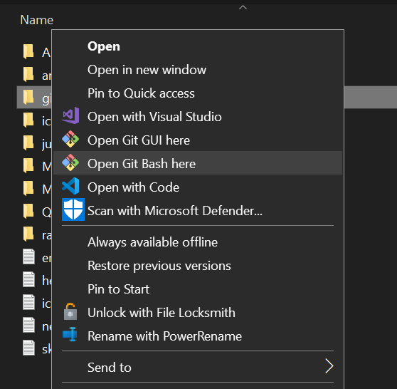

# Git Simplified

## Table of Contents
- [Introduction to Version Control](#introduction-to-version-control)
- [Setting Up Git](#setting-up-git)
- [Understanding Git Fundamentals](#understanding-git-fundamentals)
- [Working with Changes](#working-with-changes)
- [Branching and Merging](#branches)
- [References](#references)

---

## Introduction to Version Control

### What is Version Control?
Version Control is a system that records changes to a file or set of files over time, allowing you to recall specific versions later. It is particularly useful for collaborative projects, tracking changes, and ensuring project integrity.

**Types of Version Control Systems (VCS):**
- **Local VCS:** Keeps track of changes locally, but can be error-prone.
- **Centralized VCS (CVCS):** Uses a single server for all version tracking, which simplifies collaboration but introduces a single point of failure.
- **Distributed VCS (DVCS):** Every contributor has a full copy of the project history, which allows for offline work and redundancy. Git is an example of a DVCS.

### Why Git?
Git is a Distributed Version Control System (DVCS) designed for flexibility, performance, and collaboration. Its key benefits include fast operations, distributed architecture, and strong branching and merging capabilities. Git is widely used in open-source projects and enterprise environments. Git is free! $$$

### See Also:
- [About Version Control](https://git-scm.com/book/en/v2/Getting-Started-About-Version-Control)
- [Git Basics Videos](https://git-scm.com/videos)

#### [Back To Top](#table-of-contents)

<!---->

## Setting Up Git

### Installing Git
- **Windows:** Download the installer from [git-scm.com](https://git-scm.com/).
- **Linux:** Use your package manage: `sudo apt install git`
- **macOS:** Install via Homebrew with: `brew install git`

See Also: [Installing Git](https://git-scm.com/book/en/v2/Getting-Started-Installing-Git)

### Opening A Terminal
- **Windows:** Use git Bash terminal (usually installed with git as above) or optionally Command Prompt, PowerShell, or Windows Terminal.

    <figure>
        
        <figcaption>To open Git Bash, right-click in any directory/folder within windows file explorer and select "Git Bash Here."</figcaption>
    </figure>

- **Linux:** Use Terminal or your preferred Terminal Emulator.
- **macOS:** Use Terminal, iTerm, or your preferred Terminal Emulator.

### Configuration Basics

-  List all current Git Config settings with:
    ```sh
    git config --list
    ```
-  **Set User Identity:**
    ```sh
    git config --global user.name "Your Name"
    git config --global user.email your.email@example.com
    ```
-  **Set Default Editor:**
    ```sh
    git config --global core.editor notepad
    ```
-   **Set Default Branch Name:**
    ```sh
    git config --global init.defaultBranch main
    ```

### Help With Git Commands

 - Show the available Git commands with:

    ```sh
    git --help
    ```
 - Show more information about a specific command:

    ```sh
    git help add
    ``` 
    The example shows more information about the `git add` command.
    note: This will either open the manual page in your terminal or the html version in your browser

### See Also: 
- [First-Time Git Setup](https://git-scm.com/book/en/v2/Getting-Started-First-Time-Git-Setup)
- [Installing Git](https://git-scm.com/book/en/v2/Getting-Started-Installing-Git)
- [Git Command Reference](https://git-scm.com/docs/git#_git_commands)

#### [Back To Top](#table-of-contents)

<!---->

## Understanding Git Fundamentals 

### Key Concepts

- **Working Directory:** The directory on your local machine where you work on and make changes to files.
- **Local Repository:** The `.git` directory that stores the project's history and metadata.
- **Remote Repository:** A repository hosted on a remote server (e.g., GitHub, GitLab).
- **Working Tree:** The files and directories in your working directory.
- **Staging Area (Index):** A space where changes are prepared before committing.
- **Commits:** Snapshots of the project at different times, representing changes made.
- **Branches:** Pointers to specific commits, allowing for parallel lines of development.
- **HEAD:** A reference to the current branch or commit you are working on.


### Repositories and Commits

#### Creating a New Local Repository

- **Create a New Directory:**

    Navigate to your project directory and run:
    ```sh
    mkdir my_project
    cd my_project
    ```
- **Initialize a Repository:**
    From within the new directory run:
    ```sh
    git init
    ```
    This creates a new Git repository in the `my_project` directory.
    
    Now if you run `ls -lah` you should see a `.git` directory, which contains the repository data.
    ```sh
    ls -lah
    ```

- **Create a New File:**

    Create a new text file and add some content:
     ```sh
     echo "Hello, Git!" > file1.txt
     ```
     Use the shell command ls to list the files in the directory:
     ```sh
     ls
     ```
     Use the cat command to display the contents of the file:
     ```sh
     cat file1.txt
     ```
     
- **Check Repository Status:**

     Use `git status` to see the current state of your working directory:
     ```sh
     git status
     ```
     You should see `file1.txt` listed as an untracked file.
     
- **Stage the File:**

     Add `file1.txt` to the staging area:
     ```sh
     git add file1.txt
     ```
     Run `git status` again to confirm that `file1.txt` is now staged.
     
- **Commit the File:**

     Commit the staged changes with a descriptive message:
     ```sh
     git commit -m "Add file1.txt with initial content"
     ```
     This creates a commit that saves the state of `file1.txt` to the repository.

     - **Commit Messages:** Commit messages should be informative and clearly describe what changes were made and why. Good commit messages make it easier for others (and your future self) to understand the history of the project. A good commit message should be concise, yet descriptive enough to convey the context of the change.

    - **Examples of Good vs. Less Good Commit Messages:**
        - **Good:** "Add initial content to file1.txt"
        - **Good:** "Update file1.txt to include a second line explaining usage"
        - **Good:** "Update file1.txt to add additional usage instructions"
        - **Less Good:** "Updated file"
        - **Less Good:** "Fix"
        - **Less Good:** "Edited file1.txt"
     
- **Modify the File and Create Another Commit:**

     Edit `file1.txt` to add more content:
     ```sh
     echo "This is the second line." >> file1.txt
     ```
     Again use cat to view the contents of the file:
     ```sh
     cat file1.txt
     ```
     Check the status to see the changes. You will see `file1.txt` listed as modified.
     ```sh
     git status
     ```
     Stage and commit the modified file:
     ```sh
     git add file1.txt
     git commit -m "Update file1.txt with a second line"
     ```
     
- **Repeat to Build Commit History:**

     Create another file:
     ```sh
     echo "This is another file." > file2.txt
     ```
     Stage and commit the new file:
     ```sh
     git add file2.txt
     git commit -m "Add file2.txt"
     ```
     
- **Viewing Commit History:**

     Use `git log` to see the history of your commits:
     ```sh
     git log
     ```
     This will show a list of commits, including the commit messages, authors, and timestamps.

### See Also:
- [Git Basics - Getting a Git Repository](https://git-scm.com/book/en/v2/Git-Basics-Getting-a-Git-Repository)
- [Git Basics - Recording Changes to the Repository](https://git-scm.com/book/en/v2/Git-Basics-Recording-Changes-to-the-Repository)

### [Back To Top](#table-of-contents)

<!---->

## Exploring Git History

### Understanding Git History

Git history is a record of all the changes made to a repository over time. Each change is captured in a _commit_, which includes information such as the author's name, email, date, and a commit message describing the change. Commits are identified by unique SHA-1 hashes, which serve as unique identifiers to specific points in the repository's history.
    
### Key Concepts
- **Commit**: A snapshot of the project at a specific point in time, capturing changes made.
- **HEAD**: A reference to the current branch or commit you are working on.
- **SHA-1 Hash**: A unique identifier for each commit, used to reference specific points in history.
- **Hunk**: A section of a file that has been modified, added, or removed in a commit.
- **Parent Commit**: The previous commit in the history, forming a chain of commits.
- **Branch**: A pointer to a specific commit, allowing for parallel lines of development.


### **Viewing History**:
  Use `git log` to display the commit history. By default, `git log` shows each commit in reverse chronological order (most recent first).

### **Customizing Log Output**:
Git provides several options to customize the output of `git log`:

- `git log --oneline`: Displays each commit on a single line with its hash and message.<br>
- `git log --graph`: Adds an ASCII graph showing branch and merge history.
- `git log --decorate`: Shows references (like branches and tags) alongside commit messages.
- `--pretty`: Allows formatting of the log output. Options include `short`, `full`, `fuller`, `reference`, and custom formats.
- `git log --pretty=oneline`: Customize the output format, showing each commit on a single line.
- `git log --pretty=full`: Display detailed information about each commit, including author, date, and commit message.
- `git log --pretty=format:"%h - %an, %ar : %s"`: Customize the output format, showing commit hash, author, relative date, and subject.
    - Where the format option _placeholders_ are:
        - `%h`: Abbreviated commit hash
        - `%an`: Author name
        - `%ar`: Author date, relative
        - `%s`: Commit subject
    ```sh
    abc1234 - John Doe, 3 days ago : Add new feature
    def5678 - Jane Smith, 1 week ago : Fix issue \#123
    ```
- Combine options like `git log --oneline --graph` to create a visual summary of the history.

### **Filtering Commits**:

- **By Author**: Use `git log --author="Author Name"` to show commits by a specific author.

- **By Date**: Use `--since` and `--until` to limit commits to a specific time range.
    ```sh
    git log --since="2023-01-01" --until="2023-12-31"
    ```
    ```sh
    git log --since=1.week
    ```
- **By File**: Use `git log -- <file>` to show commits that affected a specific file.
    ```sh
    git log -- file1.txt
    ```
- **By String**: Use `git log -S"string"` to search for commits that added or removed a specific string.
    ```sh
    git log -S someString
    ```

- **By Message**: Use `git log --grep="keyword"` to search for keywords in commit messages
    ```sh
    git log --grep="fix"
    ```


### See Also:
- [Git Basics - Viewing the Commit History](https://git-scm.com/book/en/v2/Git-Basics-Viewing-the-Commit-History)
- [Git Log Documentation](https://git-scm.com/docs/git-log)

### [Back To Top](#table-of-contents)

<!---->

## **Viewing Changes**:

### Key Concepts
- **Diff**: The difference between two states of a file or set of files.
- **Patch**: A file containing the differences between two versions of a file, used to apply changes.
- **Commit**: A snapshot of the project at a specific point in time, capturing changes made.
- **HEAD**: A reference to the current branch or commit you are working on.
- **SHA-1 Hash**: A unique identifier for each commit, used to reference specific points in history.
- **Hunk**: A section of a file that has been modified, added, or removed in a commit.

- **Overview of the `git show` and `git diff` Commands**

Both `git show` and `git diff` are essential Git commands used to inspect changes in a repository, but they serve different purposes:

- **Basic Usage**:
    - `git show`: Displays information about a specific commit, including its metadata (author, date, message) and the changes introduced by that commit.
    - To view details of a specific commit, use:
        ```sh
        git show <commit-hash>
        ```
    - `git diff`: Compares two states in the repository, showing the differences between them. This could be between your working directory and the staging area, between commits, or between branches.
    - To view changes between two specific commits, use:
        ```sh
        git diff <commit-hash1> <commit-hash2>
        ```
---
##### **The `git show` Command**

The `git show` command is primarily used to display details of a specific commit. By default, it shows the following information:

- **Commit metadata**: Includes the commit hash, author name, date, and commit message.
- **Changes introduced**: Displays the diff of the changes made in that commit.

- **Basic Usage**
    ```sh
    git show <commit-hash>
    ```
     or
    ```sh
    git show  1a2b3c
    ```
    note: Replace `1a2b3c` with the actual commit hash you want to view. You also don't need to type the full hash. Only the first few characters are needed. Enough to be unique within the commit history.
- **Example Output:**
    ```diff
    commit -1a2b3c4d5e6f7g8h9i0jklmnopqrs
    Author: John Doe <john@example.com>
    Date:   Thu Oct 29 14:00 2024

    Add feature X

    diff --git a/file.txt b/file.txt
    index abc121..def456 100644
    --- a/file.txt
    +++ b/file.txt
    @@ -3,3 +1,4 @@
    This content wasn't changed
    This content wasn't changed
    +New line added in feature X
    ```

    - **Commit Metadata**:
        The meta data section contains information about the commit itself such as the Commit Hash, Author, Date, Message.

    - **Diff Section**:  
        The diff shows a summary of changes made in the commit. For example what lines were added or removed in each file. 

- **Detailed Output Explanation:**

    - **Line  1** `commit -1a2b3c4d5e6f7g8h9i0jklmnopqrs`
        - `commit`: This keyword indicates the start of a commit description.
        - `-1a2b3c4d5e6f7g8h9i0jklmnopqrs`: This is the unique SHA-1 hash that identifies this specific commit. Every commit in Git has a unique hash that acts as its identifier, allowing you to reference it later (e.g., `git show <commit-hash>`).

    - **Line  2** `Author: John Doe <john@example.com>`
        - `Author:`: This shows the person who created the commit.
        - `John Doe <john@example.com>`: This is the name and email of the author who made the changes in this commit. Git tracks who made each change, which is useful for collaboration and tracking history.

    - **Line  3** `Date: Thu Oct 29 14:00 2024`
        - `Date:`: This shows when the commit was made.
        - `Thu Oct 29 14:00 2024`: The exact date and time when the commit was created. This is in a standard format showing the day of the week, month, day, time, and year.

    - **Line  4** `Add feature X`
        - This is the commit message provided by the author when they created this commit. It describes what changes were made in this commit. In this case, the message is "Add feature X."

    - **Line  5** `diff --git a/file.txt b/file.txt`
        - This line indicates that Git is showing a diff (difference) between two versions of `file.txt`.
        - `a/file.txt`: The version of `file.txt` before the commit (the "old" version).
        - `b/file.txt`: The version of `file.txt` after the commit (the "new" version).

    - **Line  6** `index abc121..def456 100644`
        - `index abc121..def456`: This shows the file's state before and after the commit using shortened SHA-1 hashes (`abc121`, `def456`). These hashes represent the content of `file.txt` at different points in time:

        - `abc121`: The hash for the old version of `file.txt`.
        - `def456`: The hash for the new version of `file.txt`.

        - `100644`: This represents the file's permissions in Unix format (rwxrwxrwx). 
            - 100 (file type): Indicates a regular file.
            - 6 or rw- (permissions for the owner): Read and write permissions. 
            - 4 or r-- (permissions for the group): Read-only permissions.
            - 4 or r-- (permissions for others): Read-only permissions.

     - **Line  7** `--- a/file.txt`
            - The `--- a/file.txt` line shows that this is the old version of `file.txt`, before any changes were made.

     - **Line  8** `+++ b/file.txt`
            - The `+++ b/file.txt` line indicates that this is the new version of `file.txt`, after changes were applied.

     - **Line  9** `@@ -3,3 +1,4 @@`
        This is called a hunk header, which gives context about where changes occurred in the file:
        - `-3,3`: Refers to lines in the old file (`a/file.txt`). 
            - It means that in the old version, starting at line 3 spanning 3 lines.
        - `+1,4`: Refers to lines in the new file (`b/file.txt`). 
            - It means that in the new version, starting at line 1, there are now 4 lines.

        - In the old file (`a/file.txt`) starting from line 3, there were only 3 lines.
        - In the new file (`b/file.txt`) starting from line 1, there are now 4 lines (indicating that one or more lines have been added).

    - **Line  10** Line `This content wasn't changed`:
        - This line starts with no special symbol (neither `+` nor `-`). This means it is an _unchanged_ line present in both versions of the file.

    - **Line  11** Line `This content wasn't changed`:
        - Similar to "Line 10", this line has no special symbol and is present in both versions of the file without modification.

    - **Line  12** Line `+New line added in feature X`:

        - The leading `+` symbol indicates that this line was added in the new version (`b/file.txt`) but did not exist in the old version (`a/file.txt`).
        - The text "New line added in feature X" suggests that this line was introduced as part of implementing "feature X."

##### **More `git show` Options:**

- `git show <commit-hash>`: Displays details of a specific commit identified by its hash.
- `git show HEAD`: Shows details of the latest commit on your current branch.
- `git show <branch>`: Shows details of the latest commit on a specified branch.
- `git show --stat`: Displays a summary of changes (number of insertions and deletions) without showing the full diff.
- `git help show`: Opens the manual page for the `git show` command.

---
##### **The `git diff` Command**

The `git diff` command is used to compare different states in your repository. It highlights differences between files or commits at various stages.

 - **Basic Usage**
    - Compare working directory with staging area (unstaged changes. Useful before staging changes for a commit)
    ```sh
    git diff
    ```
    - Compare staging area with last commit (useful before committing)
    ```sh
    git diff --staged
    ```
    - Compare the current commit (`HEAD`) with its parent (`HEAD~1`) and shows what has changed between them. (Useful to see the changes in the last commit or remember what you were doing.)
    ```sh
    git diff HEAD~1 HEAD
    ```
    - Compare any two commits throuout the history
    ```sh
    git diff <commit1> <commit2>
    ```

    - Example Output:
        ```diff
        diff --git a/file.txt b/file.txt
        index abc123..def456 100644
        --- a/file.txt
        +++ b/file.txt
        @@ -1,3 +1,4 @@
        Line 1
        Line 2
        +New line added in feature X
        ```
##### **More `git diff` Options:**

-   `git diff --stat`: Shows a summary of changes (number of files changed, lines added/removed).
-   `git diff --name-only`: Lists only the names of files that differ.
-   `git diff branchA branchB`: Compares two branches to see differences between them.
-   `git diff -w`: Ignores whitespace changes.
-   `git diff help`: Opens the manual page for the `git diff` command.

### Undoing Changes
- **Unstage Files:** Use `git reset [file]`.
- **Amend Commits:** Modify the last commit with `git commit --amend`.
- **Stashing Changes:** Temporarily save changes with `git stash`.

- **Practical Example**:
  - Suppose you accidentally made some changes to `file1.txt` that you don't want to keep. You can:
    1. Use `git log` to find the commit hash where `file1.txt` was last correct.
    2. Use `git checkout <commit-hash> -- file1.txt` to restore that version.
    3. Stage and commit the restored version if needed.

 **Practical Examples**:
  - After making multiple commits, running `git log` provides a complete overview of all changes.
  - Use `git log --stat` to display statistics for each commit, such as the number of files changed and lines added/removed.
  - For a more detailed history, use `git log --pretty=format:"%h - %an, %ar : %s"` to customize how each commit is displayed.

- **Restoring Files to a Previous Commit**:
  - Use `git checkout <commit-hash> -- <file-path>` to restore a specific file to its state in a previous commit. This is useful for rolling back changes to individual files.
  - **Example**:
    ```sh
    git checkout abc1234 -- file1.txt
    ```
    This command restores `file1.txt` to the version from the commit with hash `abc1234`.
  - After restoring, you can commit the changes if you want to keep them:
    ```sh
    git add file1.txt
    git commit -m "Restore file1.txt to previous version"
    ```

- **Exploring Files and Their Content**:
  - Use `git show <commit-hash>:<file-path>` to explore the content of a file at a particular commit without modifying your working directory.
  - **Example**:
    ```sh
    git show abc1234:file1.txt
    ```
    This command displays the content of `file1.txt` as it was in the commit with hash `abc1234`.

- **Returning to the Current State**:
  - If you checked out a previous commit or restored files to an older state, you can return to the latest commit on your branch by using:
    ```sh
    git checkout main
    ```
    This command will move you back to the `main` branch, restoring the current state of all files.
    
---
### [Back To Top](#table-of-contents)
---

## Branches

### Branches Explained
Branches are essentially different versions of your project that coexist in parallel. This allows developers to work on features, fixes, or experiments without affecting the main codebase. The main branch in Git is commonly called `main` or `master`. Creating branches is a core part of Git's power, enabling collaborative workflows and feature isolation.

- **Why Use Branches?**
  - **Isolate Features:** Each feature or bug fix can be developed in its own branch, keeping the main branch clean and functional.
  - **Parallel Development:** Multiple developers can work on different features simultaneously without interfering with each other's code.
  - **Testing and Experimentation:** Branches make it safe to experiment. If something goes wrong, the main branch remains unaffected.

A common approach is **Git Flow**, where developers use separate branches for new features (`feature/branch-name`), bug fixes (`hotfix/branch-name`), and releases (`release/branch-name`). This allows structured and organized project development.

### Branch Operations


list branches:
```sh
git branch
```
note: the current branch is indicated with an asterisk (`*`).

Add a file with some content on the current branch. Then add and commit the changes as before:
```sh
echo "This is a original content on branch main." > file.txt
git add file.txt
git commit -m "Add file.txt with original content"
```

### 1. Create a Branch
To create a new branch, you use the `git branch` command followed by the branch name:
```sh
git branch feature-xyz
```
This command creates a new branch named `feature-xyz` based on your current branch. However, you will still be on the original branch (e.g., `main`). To start working on the new branch, you need to switch to it.

### 2. Switch Branch
To move to another branch, you use the `git checkout` command:
```sh
git checkout feature-xyz
```
Alternatively, with newer versions of Git, you can use the more intuitive `git switch`:
```sh
git switch feature-xyz
```
Now you are on the `feature-xyz` branch, and any changes you make will be specific to this branch.

### 3. Create and Switch in One Step
You can also create and switch to a new branch in a single step using:
```sh
git checkout -b feature-xyz
```
or:
```sh
git switch -c feature-xyz
```
This is a handy way to streamline your workflow when starting new features.

### 4. Modifying the file in the new branch
Edit the file in the new branch:
```sh
echo "This is a new feature" >> file.txt
```
This command appends a line to `file.txt`, indicating that this change is part of the `feature-xyz` branch.

### 5. Switch Back to the Main Branch
After making changes in the `feature-xyz` branch, you can switch back to the `main` branch:
```sh
git checkout main
```
This command moves you back to the `main` branch, where you can continue working on other tasks or merge changes from feature branches.

### 6. Merge Changes from the Feature Branch  
Once you have finished working on a branch, you often want to merge those changes back into the `main` branch. You first switch back to `main` and then use the `git merge` command:
```sh
git checkout main
git merge feature-xyz
```
This will integrate the changes from `feature-xyz` into `main`. If there are no conflicting changes, Git will perform a **fast-forward merge** or an **automatic merge**.

### 7. examine the contents of the file
To see the contents of the file, you can use the `cat` command:
```sh
cat file.txt
```
### 8. Delete the Feature Branch (Optional)
Once merged, you can delete the `feature-xyz` branch if it's no longer needed:
```sh
git branch -d feature-xyz
```

---
### [Back To Top](#table-of-contents)
---

## References
- **Official Git Documentation**: [Git Documentation](https://git-scm.com/doc)
- **Official Pro Git Book**: [Git Book](https://git-scm.com/book/en/v2)
<!-- - **Interactive Tutorials**: [Learn Git Branching](https://learngitbranching.js.org/) -->
- **Glossary of Terms**: [Glossary](https://git-scm.com/docs/gitglossary)
- **Git Reference Manual**: [Git Reference](https://git-scm.com/docs)

---
### [Back To Top](#table-of-contents)
---
